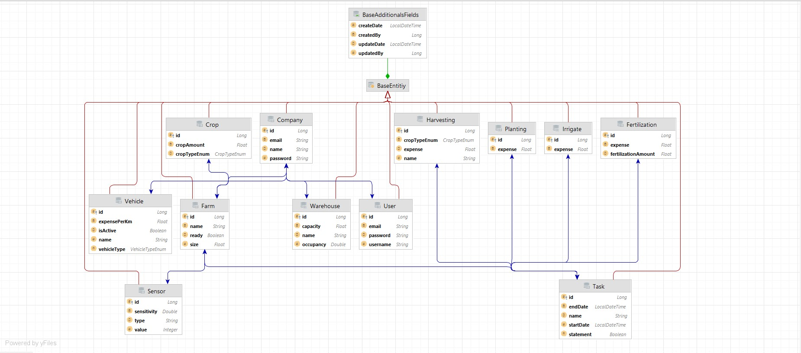

# Smart Farm Project

Bu proje şirketlerin tarım arazilerinin durumunu tek elden yönetilmesi için geliştirilmiş bir otomasyon projesidir.

## API Kullanımı


```http
  GET v1/farm/all --> Şirkete ait tüm arazilerini getirir 
```
```http
  Post v1/farm --> yeni tarım arazisi kayıt yapar  
```
```http
  Get v1/user/All --> Tüm kullanıcıları getirir
```
```http
  Post v1/user/save --> yeni kullanıcı  kayıt yapar  
```
```http
  Get v1/company/All --> Tüm şirketleri getirir
```
```http
  Post v1/company/save --> yeni şirket  kayıt yapar  
```
```http
  Post v1/company/saveFarm/{companyId} --> urlde verilen idli şirkete yeni tarım arazisi kaydeder 
```
```http
  Post v1/company/saveUser/{companyId} --> urlde verilen idli şirkete yeni kullanıcı  kaydeder 
```
```http
  Post v1/company/saveVehicle/{companyId} --> urlde verilen idli şirkete yeni araç kaydeder 
```
```http
  Post v1/company/saveWarehouse/{companyId} --> urlde verilen idli şirkete yeni depo  kaydeder 
```
```http
  Get v1/company/{id} --> urlde verilen idli şirketi getirir 
```
```http
  Post v1/task/execute --> Dto da geçilen verilere göre tarım arazisi için bir görev kaydeder 
```
## Entity Relationship Diagram




## Bilgisayarınızda Çalıştırın

Projeyi klonlayın

```bash
  git clone https://github.com/Erayakg/SmartFarmProject.git
```

Proje dizinine gidin

```bash
  clean-install  maven
```

Sunucuyu çalıştırın

```bash
  run start
```

## Kullanılan Teknolojiler

Springboot , Mysql ,Hibernate , Jpa 

## Lisans

[MIT](https://choosealicense.com/licenses/mit/)


  